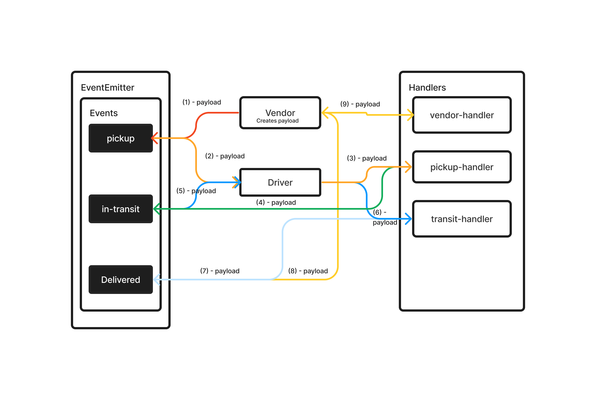

# LAB - Class 11, 12

## Project: CAPS

### Author: Jelani R

### Problem Domain

CAPS simulates a delivery service where vendors (such a flower shops) will ship products using our delivery service and when our drivers deliver them, each vendor will be notified that their customers received what they purchased.

The goal is to setup a pool of events and handler functions, with the intent being to refactor parts of the system throughout the week, but keep the handlers themselves largely the same. The task of “delivering a package” doesn’t change (the handler), even if the mechanism for triggering that task (the event) does.

The following user/developer stories detail the major functionality for this phase of the project.

As a vendor, I want to alert the system when I have a package to be picked up.
As a driver, I want to be notified when there is a package to be delivered.
As a driver, I want to alert the system when I have picked up a package and it is in transit.
As a driver, I want to alert the system when a package has been delivered.
As a vendor, I want to be notified when my package has been delivered.
And as developers, here are some of the development stories that are relevant to the above.

As a developer, I want to use industry standards for managing the state of each package.
As a developer, I want to create an event driven system so that I can write code that happens in response to events, in real time.

### Links and Resources

- [GitHub Actions ci/cd](https://github.com/Jchips/caps/actions)
- [Pull Request](https://github.com/Jchips/caps/pull/1)

### Setup

#### `.env` requirements

- PORT=your-port-number

#### How to initialize/run your application

- `nodemon` (if installed) OR
- `npm start`

#### Features / Routes

- What was your key takeaway?

  My key takeaway is an understanding of the basics of event driven programming and a stronger understanding of mock functions with jest. Also, learning how to use Socket.io.

- Events

  - pickup - picked up package
  - in-transit - package is in-transit
  - delivered - package is delivered

- Pull requests:

    <https://github.com/Jchips/caps/pull/1>
    <https://github.com/Jchips/caps/pull/2>

#### Tests

- How do you run tests?
`npm test`
- Any tests of note?
  - Makes sure the handlers are all doing what's expected.

#### UML

